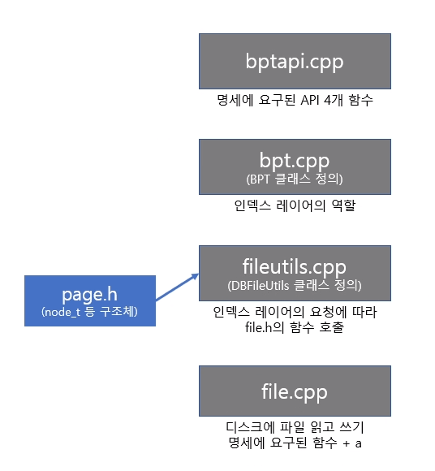
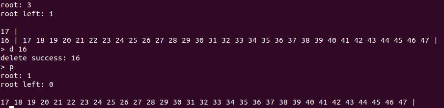
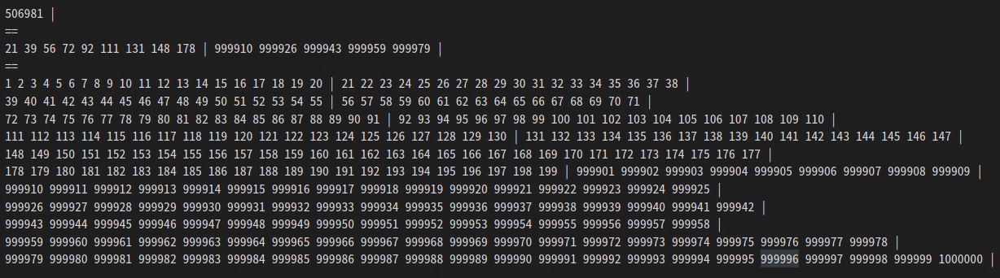

# 개요
## 환경
```
1. Ubuntu 18.04 (테스트)
2. Ubuntu 20.04 (실제 소스코드 작성)
3. g++ 7.5.0
4. C++ 17
```
## 컴파일 옵션
```
-g -fPIC -I -std=c++17 -W -Wall
```
## 소스코드
```
- file.cpp (file.h)
- page.cpp (page.h)
- fileutils.cpp (fileutils.h)
- bpt.cpp (bpt.h)
- bptapi.cpp (bptapi.h)
- main.cpp
```
</br>

# 전체적인 구조
<center>

</center> 
</br>

- file.h에 명세된 요구된 함수를 포함해서 필요하다고 생각되는 함수와 page_t 구조체를 선언하고, file.cpp에 정의하였다. file.cpp에 정의된 함수들에서는 실제로 system call을 통하여 디스크에 읽고 쓰는 작업을 진행하도록 하였다.  
- page.h에는 인덱스 레이어에서 page_t 구조체를 바로 가져다 쓰는 것은 어려울 수도 있겠다고 판단하여 새롭게 node_t 구조체를 만들어주었다.  
- fileutils.h에는 DBFileUtils 클래스를 선언하고, fileutils.cpp에서 멤버 함수들을 정의해주었다. 해당 클래스에서는 상위 레이어의 요청에 따라 file.h의 함수들을 호출하도록 하였다.  
- bpt.h에는 BPT 클래스를 선언하고 bpt.cpp에서 멤버 함수들을 정의해주었다. 실제로 인덱스 레이어의 역할을 하는 클래스이다.  
- bptapi.h에는 명세에 요구된 4개의 함수를 선언하고, bptapi.cpp에서 정의하였다.
</br> </br>

# file.h & file.cpp
```c++
struct page_t {
    union page
    {
        uint8_t bytes[PAGE_BYTE];
        struct header_page
        {
            pagenum_t free_page_num;
            pagenum_t root_page_num;
            uint64_t number_of_pages;
        } header_page_;
        struct free_page
        {
            pagenum_t next_free_page_num;
        } free_page_;
    } page_;
};
```
page_t의 구조는 위와 같다. 페이지를 union으로 선언하여 header page나 free page 모두 page_t 하나로 관리할 수 있도록 하였다.
</br> </br>

```C++
pagenum_t file_alloc_page();

void file_free_page(pagenum_t pagenum);

void file_read_page(pagenum_t pagenum, page_t* dest);

void file_write_page(pagenum_t pagenum, const page_t* src);

int file_open_db(const char* pathname);

int file_close_db(int fd);

void set_current_db_fd(int fd);
```
위는 file.h에 선언된 함수들이다. 
file_alloc_page, file_free_page, file_read_page, file_write_page는 명세에서 요구한 함수들이고, 나머지는 필요하다고 판단된 함수들을 선언하였다.  
* **set_current_db_fd** 함수는 file.cpp에 정의되어있는 전역변수 current_db_fd에 인자로 받은 값을 저장하는 함수이다. file.h에 선언된 다른 함수들은 이 전역변수에 저장되어있는 file descriptor 값으로 파일을 읽고 쓰는 작업을 하게 된다.
* **file_open_db** 함수에서는 인자로 받은 파일명으로 open 시스템 콜을 통해 db 파일을 여는 함수이다. 이후에 반환받은 file descriptor 값을 set_current_db_fd 함수를 통해 current_db_fd 값에 저장해준다. 만약 열어준 파일이 크기가 0이라면, 즉 새로 생성한 파일이라면 헤더 페이지를 생성해준다.
* **file_close_db** 함수에서는 인자로 받은 file descriptor를 통해 close 시스템 콜로 파일을 닫는다.
* 이외에 file.cpp에 선언된 **file_write_page_array** 함수에서는 인자로 주어진 page_t 배열을 파일에 쓰고, **file_alloc_page**와 **file_wirte_page** 함수에서 이를 호출하는 방식으로 각각의 목적을 달성하게 된다.
* **file_alloc_page**의 경우 free page list에서 페이지를 가져오되, 헤더의 free page num이 0일 때, 즉 더 이상 free page가 없는 경우 FREE_PAGE_GROWTH (현재는 20으로 설정) 개수 만큼의 free page를 새로 만들어준다.

</br>

# page.h & page.cpp
실제로 index layer 단에서 쓸 수 있는 node_t 구조체를 정의하였다.
```c++
struct node_t {
    struct header {
        pagenum_t parent;
        bool is_leaf;
        uint32_t number_of_keys;
        char reserved[104];
        pagenum_t spare_page;
    } header_;
    union body
    {
        std::array<record_t, 31> records;
        std::array<child_t, 248> childeren;

        body();
    } body_;
};
```
Internal node와 Leaf node가 Header은 동일하지만 Body는 다르기 떄문에 body의 경우 Union으로 선언해 Internal 노드는 children 멤버, Leaf 노드는 records 멤버를 사용하면 되도록 하였다.

# fileutils.h & fileutils.cpp
* fileutils.h에 선언된 **DBFileUtils** 클래스는 파일에 읽고 쓰는 작업을 관리하는 매니저 역할을 하는 클래스이다. 상위 레이어, 여기서는 인덱스 레이어에서 요구하는 경우 파일에서 페이지, 즉 노드를 읽어오거나 노드를 파일에 쓰는 작업을 하되, file.h의 함수들을 호출해서 해당 작업들을 하도록 하였다.  
* 이 클래스는 객체가 전역에 하나만 존재하는 것이 맞다고 판단하여 싱글턴 패턴을 활용하여 전체에 하나의 객체만 존재하도록 하였으며, 후에 여러 파일을 열어야 할 상황을 가정하여 여러 파일의 file descriptor 값을 넣어두어 관리할 수 있는 table_list 멤버를 가지도록 하였다.  
* 이외에 **bpt_node** 라는 새로운 구조체를 정의하여 생성자에서 자동으로 파일에서 읽어오도록 하는 등, 조금 더 쉽게 노드를 관리할 수 있도록 하였다.
</br></br> 

# bpt.h & bpt.cpp
## 공통
```
- bpt.h에 선언된 **BPT** 클래스는 Index Layer 역할을 하는 클래스이다.

- 원래 bpt.c에 구현된 내용을 수정하는 방식으로 작성하였다.

- 기존 bpt.c에서는 Leaf 노드의 경우 pointer[order - 1]가 right sibling을 가리키도록 하였고, 
Internal 노드의 경우 pointer[0]가 left-most child를 가리키도록 되어있었는데, 여기서는 이 둘의 역할을 하는 부분이 따로 있었다. 
해당 부분은 node_t를 정의하면서 spare_page라고 이름붙였다.

- 기존 bpt.c에서는 pointer와 key를 각각의 배열로 관리하였으나, 
여기서는 (key, child), 또는 (key, value)로 묶어 하나의 배열로 관리하고 있으므로 
이에 따르는 차이들도 반영해주었다.
```
## Insert
Insert의 경우 기존 bpt.c와 거의 비슷하게 구현하였다.

## Delete
기존 bpt.c에서는 Delete시에 근처 노드(neighbor node)의 상태를 확인하여 Merge 혹은 Redistribution을 진행하였는데, 여기에서는 최대한 트리의 변형 작업을 하지 않기 위해 Delay Merge를 하기로 하였으므로 키가 모두 삭제되었을 때만 Merge를 진행하도록 하였다.
</br> </br>
키가 모두 삭제된 후 Merge를 진행한다는 것은 사실상 해당 노드를 삭제하는 것과 거의 같으므로 실제로도 삭제하는 것과 같이 구현하였다.  
만약 키가 모두 삭제되어 머지되어야하는 노드가 가장 왼쪽 노드라면 해당 노드의 오른쪽 노드의 (키, 값) 또는 (키, 자식 Page number) 쌍 들을 모두 해당 노드로 옮겨준 후 오른쪽 노드를 삭제하였다.  
이외의 경우는 그냥 해당 노드를 삭제하고, Internal 노드의 경우 B+Tree의 특성을 유지하기 위해 부모에서 키를 가져와 옆 노드 끝에 붙여주는 방식으로 진행하였다.  
</br>
아래 사진을 참고하자.

</br>
상황은 1부터 47까지 순서대로 넣은 후, 다시 1부터 15까지 삭제한 결과이다.  
여기서 16을 삭제해볼 것이다.  
pagenum을 잘 살펴보자.
원래 root의 pagenum은 3이었고, 그 왼쪽 자식은 1이었음을 알 수 있다. 하지만 왼쪽 노드의 16이 사라지면서 Merge를 해주어야 할 필요성이 생겼고, 따라서 오른쪽 노드의 모든 값들을 왼쪽에게 옮기고 오른쪽 노드를 삭제해주면서, 원래 root노드가 삭제되고, 그 결과 원래 root의 왼쪽 자식 노드가 새로운 root가 된 모습을 확인할 수 있다. 
</br> </br>
하지만 해당 방식에는 문제가 있는데, 만약 Internal 노드의 경우 옆 노드에 더 이상 자리가 없다면 부모에서 키를 가져와 옆 노드 끝에 붙여주는 방식으로 Merge를 진행할 수 없다는 것이다. 이러한 경우에는 어쩔 수 없이 Redistribution을 진행해야한다고 판단하였다.  
만약 키가 만약 키가 모두 삭제되어 머지되어야하는 노드가 왼쪽 노드라면 그 오른쪽 노드의 가장 왼쪽 자식, 즉 spare_page가 가리키는 자식을 해당 노드로 가져오는 방식으로 구현하였다.  
이외의 경우에는 그 왼쪽 노드에서 가장 마지막 자식을 해당 노드로 가져오는 방식으로 구현하였다.
</br>

## 이외
디버깅, 테스트를 위해 print tree와 print leaf를 해주는 함수를 추가적으로 구현하였다.
</br></br>

# bptapi.h & bptapi.cpp
**bptapi.h**에는 명세에서 요구한 네 개의 함수를 선언하였다. bptapi.cpp에 전역으로 BPT 객체를 선언하고, 해당 객체의 함수들을 호출하는 방식으로 구현하였다.  
이외에 디버깅, 테스트를 위해 print tree와 print leaf를 해주는 함수를 구현하였다. 역시 BPT 객체의 함수를 호출하는 방식으로 구현하였다.
</br></br>

# 기타: 테스트
테스트를 위해 Makefile에 아래와 같은 부분을 추가하였다.
```Makefile
TEST_SRC:=$(SRCDIR)test.cpp
TEST_OBJ:=$(SRCDIR)test.o

TEST2_SRC:=$(SRCDIR)test2.cpp
TEST2_OBJ:=$(SRCDIR)test2.o
```
```Makefile
test: $(TEST2_OBJ) $(OBJS_FOR_LIB)
	make static_library
	$(CC) $(CXXFLAGS) -o $@ $< -L $(LIBS) -lbpt

debug: $(TEST_OBJ) $(OBJS_FOR_LIB)
	make static_library
	$(CC) $(CXXFLAGS) -g -o $@ $< -L $(LIBS) -lbpt
```
그냥 make 명령은 main 실행파일을 생성하지만 make test, make debug 명령을 통해 테스트 실행파일을 따로 생성할 수 있게 하였다. 
</br></br> 
실험을 위해 넣을 input 파일은 파이썬을 통해 자동으로 생성할 수 있게 하였다.

```python
import random

f = open("./test/test.txt", 'w')
f.write("o t.db\n")
test_list_insert = list(range(1, 1000001))
test_list_delete = list(range(200, 999901))
test_list_find = list(range(1, 1000001))
random.shuffle(test_list_insert)
random.shuffle(test_list_delete)
#test_list.reverse()
for i in test_list_insert:
    f.write("i " + str(i) + " test " + str(i) + "\n")
    #f.write("f " + str(i) + "\n")
    #f.write("d " + str(i) + "\n")
for i in test_list_delete:
    #f.write("i " + str(i) + " test " + str(i) + "\n")
    #f.write("f " + str(i) + "\n")
    f.write("d " + str(i) + "\n")
for i in test_list_find:
    #f.write("i " + str(i) + " test " + str(i) + "\n")
    f.write("f " + str(i) + "\n")
    #f.write("d " + str(i) + "\n")
f.write("p")

f.close()
```

위와 같이 랜덤으로 insert, delete, find를 진행하도록 하였고, 총 100만개의 insert에서도 정상적으로 작동함을 확인할 수 있었다.  
아래 사진은 위 테스트를 진행 후 트리를 출력한 것이다. 너무 길어 리프노드는 줄을 나누어보았다.



</br>
의도했던 바와 같이 리프노드에 1부터 199까지, 그리고 999901부터 1000000까지 잘 들어있는 것을 확인할 수 있었다.