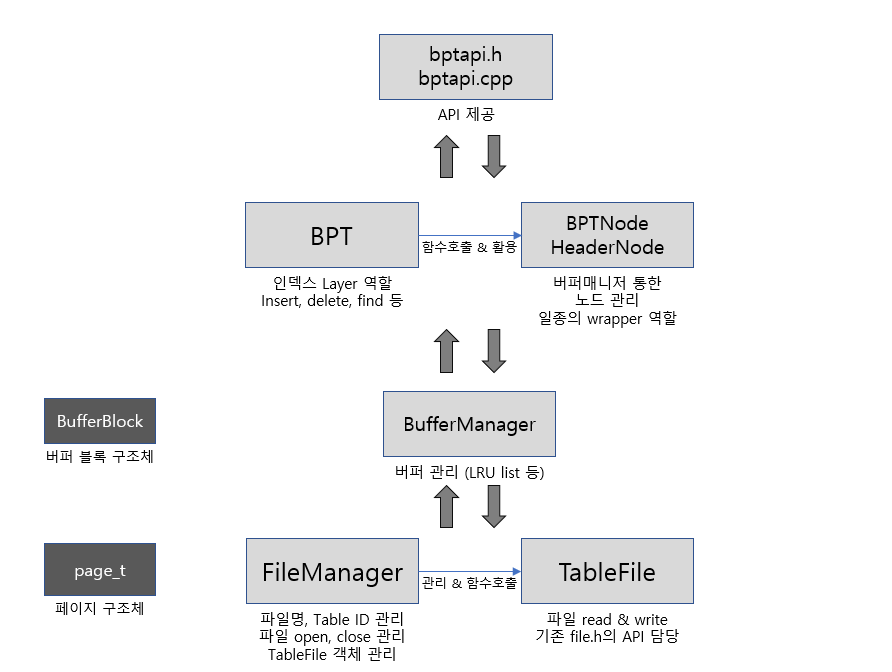

# 개요
## 환경
```
1. Ubuntu 18.04 (테스트)
2. Ubuntu 20.04 (실제 소스코드 작성)
3. g++ 7.5.0
4. C++ 17
```
## 컴파일 옵션
```
-g -fPIC -I -std=c++17 -W -Wall
```
## 소스코드
```
- enums.h
- file.cpp (file.h)
- page.cpp (page.h)
- file_manager.cpp (file_manager.h)
- buffer_manager.cpp (buffer.h, buffer_manager.h)
- bpt_node.cpp (bpt_node.h, bpt_node_impl.hpp)
- bpt.cpp (bpt.h)
- bptapi.cpp (bptapi.h)
- main.cpp
```
</br>

# 전체적인 구조
<center>

</center> 
</br>

# FileManager & TableFile
## 구현에 대한 설명

1. project2 에서 file.c에 있던 함수들을 TableFile 클래스로 묶어 file descriptor와 같이 관리하였다. 
즉, file descriptor를 멤버 변수로 가지고, 기존 file.c의 함수들을 멤버 함수로 가지는 클래스인 TableFile을 정의하였다.

2. project2 에서 DBFileUtils 클래스의 이름을 FileManager로 변경하는 것이 적절하다고 판단하여 변경해주었다. 

3. 파일 Open, Close 등을 수행하며, TableFile 객체를 관리, 상위 레이어의 호출에 따라 
적절한 TableFile 객체를 찾아 해당 객체의 함수를 호출해주는 등의 역할을 한다. 

4. Table ID의 경우 현재 프로젝트에서 파일과 1 대 1 매칭이 되며, 
파일 경로와 TableFile 객체 Table ID를 matching하는 작업 등이 필요하므로 
FileManager 클래스에서 Table ID를 부여, 관리해주는 것이 합당하다고 판단하여 이와 같이 구현하였다.

</br>

## page_t 구조체
project2 에서 header page, free page는 page_t 구조체로, B+ Tree의 노드 역할을 하는 페이지는 node_t 구조체로 관리하여, 분리하였으나 project3 에서는 버퍼까지는 같은 형태로 관리해야 한다고 판단하여 page_t와 node_t를 union으로 묶어 page_t 구조체 하나로 관리하였다.

</br>

# BufferManager
## 구현에 대한 설명

1. BufferManager 클래스에서는 Buffer를 관리하는 여러 멤버 함수들을 구현하였다. LRU policy를 통한 Victim 선정, pin 관리 등을 해주는 클래스이다.

2. 버퍼는 BufferBlock 구조체 배열로 구현하였으며, 버퍼 초기화 시 파라미터로 받은 크기로 동적할당하였다. 

3. LRU policy 구현을 위한 linked list의 경우에는 next, prev block을 포인터가 아닌 배열의 인덱스로 가리키도록 구현하였다. 

4. 위와 같이 구현하면, 한 번 버퍼에 올라온 페이지는 eviction 되거나 table close, 또는 shutdown 등의 이유로 버퍼에서 내려갈 때까지 버퍼 배열의 같은 인덱스에 위치하므로 버퍼 블록의 위치를 찾기가 쉬워진다.

5. STL의 unordered map을 활용하여 (table id, page number)을 키로, 해당하는 버퍼의 블록 인덱스를 value로 가지는 해시 테이블을 만들고, 후에 버퍼 블록을 찾을 때 이 해시 테이블을 사용하도록 하였다. 키가 pair 형태이므로 해시 함수는 STL의 해시 함수로 구한 두 해시 값을 XOR 하는 방식으로 구현하였다. 

    [[해시함수는 이곳을 참조하였다. | https://stackoverflow.com/questions/5889238/why-is-xor-the-default-way-to-combine-hashes]]

</br>

## BufferBlock 구조체
기본적으로 명세를 따랐으나, is_pinned 대신 pin_count를 사용하여, 페이지를 사용할 때 pin count를 올려주고, 페이지 사용을 끝낼 때 pin count를 내려주는 방식을 채택하였다.