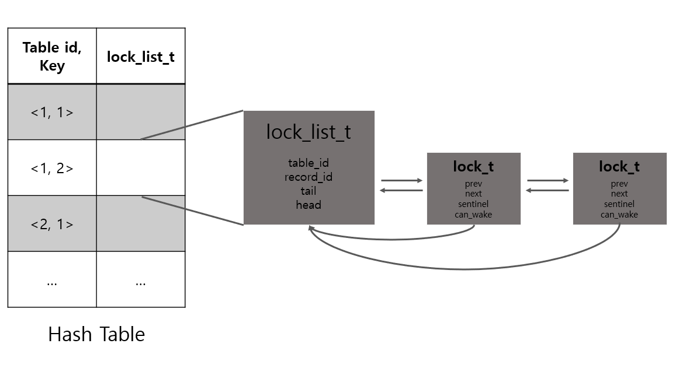

# 개요
## 환경
```
1. Ubuntu 18.04 (테스트)
2. Ubuntu 20.04 (실제 소스코드 작성)
```
## 소스코드
```
- lock_table.h
- lock_table.cpp
```
</br>

# 전체적인 구조
<center>

</center> 
</br>

# Hash Table
Hash Table은 c++ STL의 unordered_map을 사용하였다.
project3에서와 마찬가지로 unordered_map의 key는 <Table id, Key> 쌍을 std::pair로 묶어 사용하였고, value는 lock_list_t 객체를 넣어주었다.  
Hash function은 project3과 마찬가지로 두 hash값을 xor 해주는 방식으로 구현하였다.

# lock_list_t
lock_t 객체로 이루어진 링크드 리스트의 head와 tail을 담고 있는 객체이다.

# lock_t
링크드 리스트의 다음, 그리고 이전 객체를 가리키는 포인터를 담고 있으며 conditional variable에서 조건이 되는 역할을 해 줄 can_wake 멤버 변수를 담았다.    
lock_acquire 함수에서 lock_t 객체를 새로 생성해서, 만약 head가 될 상황이라면 can_wake를 true로 설정해준 채 바로 리턴하였다.
이외의 경우는 can_wake를 false로 설정해주고 wait(sleep) 하도록 하였다.    
lock_release 함수에서 release 하고자 하는 lock_t 객체를 링크드 리스트에서 제거하고, 그 다음 lock_t 객체의 can_wake를 true로 설정해 준 뒤, notify_all 함수를 통해 해당 쓰레드를 깨워주도록 하였다.

# STL mutex, condition_variable, unique_lock
이번 과제에서는 STL의 여러 클래스와 함수들을 활용하였다.  
특히, unique_lock을 씀으로써 직접 unlock 해주지 않아도 자동으로 unique_lock 객체가 파괴될 때 같이 unlock 해주도록 하였다.  